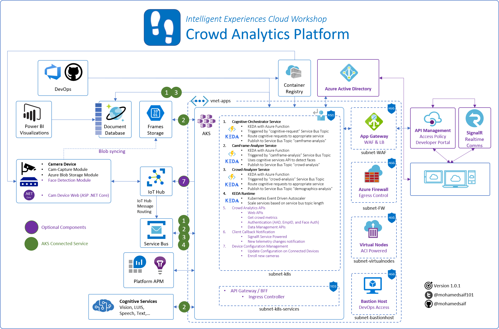

# Intelligent Experiences On Containers

Hands-on workshop to create containers-based backend platform that exposes async AI services

|Service|Build|Release|
|-|-|-|
|CognitiveOrchestrator||TBD|
|CoreLib|||
|CamFrameAnalyzer|TBD|TBD|
|CrowdAnalysis.Dashboard|TBD|TBD|

## Overview

Almost all retail shops already include a networked CCTV cameras all over the store. Why not extend these cameras capability to include some useful intelligence on top of it to improve customers experiences trough innovation and AI.

>NOTE: Leveraging and designing AI powered solutions should always adhere to responsible and ethical principles that reflect trust and timeless values. I personally like Microsoft's principles about fairness, inclusiveness, reliability, safety, transparency, privacy, security and accountability. [Read more](https://www.microsoft.com/en-us/AI/our-approach-to-ai)

### Crowd Analytics

This workshop walks through the steps to deploy a connected, secure and reliable **Crowd Analytics** platform leveraging cloud native solution.

Crowd analytics (also known as footfall analytics) is about understanding who (age, gender, emotion,...) visit your location, when and how many.

Crowd analytics scenario can be used in:

1. Retail shops in many industry (like telecom shops, consumer goods retailers, malls…)
2. Public and Private Parks
3. Events
4. Any many other scenarios

Using advanced cloud technologies can provide key business metrics that allows stakeholders to make informative decisions to improve experience and/or performance.

### Multi-Factor Authentication

Authentication is a key part of almost all security measures.

2-Factor authentication is becoming more and more a requirement rather than a fancy option.

In the workshop, crowd analytics dashboard is protected by a 3-factor authentication

1. Something you know: username and password
2. Something you have: your employee ID
3. Something you are: face verification

Several discussions with enterprises always brought up in my meetings adding extra layer of security to their regular user name and password.

Although Azure Active directory has built-in multi-factor authentication and conditional access, it was fun to extend it through AI-powered services to scan the employee ID (OCR and Forms Recognition) and Face ID cognitive services.

### Azure Technologies

Azure already provides a sophisticated platform to develop and operate such system.

**Kubernetes** became the defacto cloud native technology to develop and operate sophisticated containerized systems anywhere and with Azure Kubernetes Service takes a lot of the cluster management tasks out of your way to focus more on the solution you want to build.

Key technologies used in the workshop include:

- Azure Kubernetes Service (AKS)
- Azure IoT Hub
- Azure Cognitive Services
- and many more

I'm really excited to share with you the great journey I took to build such system.

## Workshop Agenda

1. Dev Environment Setup
    - Visual Studio Code
    - Azure CLI
2. Solution Whiteboarding & Architecture
3. Creating Azure Prerequisites
    - Resource Group
    - Storage Account
    - Cosmos DB
    - Service Bus
    - Cognitive Service
    - Container Registry
    - Virtual Network
    - Log Analytics
    - App Insights for each app
4. AKS Cluster
    - Essential kubernetes cluster provisioning
    - OPTIONAL: AKS Secure Deployment
5. Creating IoT Hub and IoT Edge Device
    - IoT Hub Provisioning
    - IoT Edge Device Provisioning
    - Testing the connectivity
6. Services Deployment & Testing
    - DevOps Setup
    - Services Deployment
    - Testing
7. BONUS Tracks
    - Secure AKS Provisioning
        - Azure AD Integration
        - Application Gateway Ingress Controller
        - Azure Firewall and Egress Lockdown
    - Realtime Communication
        - Cosmos DB Change Feed
        - SignalR client communication
    - IoT Edge Advance Deployment
        - Adding Face Detection Module
        - Using Raspberry Pi with USB Camera

## About the project

I tried to make sure I cover all aspects and best practices while building this project, but all included architecture, code, documentation and any other artifact represent my personal opinion only. Think of it as a suggestion of how a one way things can work.

Keep in mind that this is a work-in-progress, I will continue to contribute to it when I can.

All constructive feedback is welcomed 🙏

## Support

You can always create issue, suggest an update through PR or direct message me on [Twitter](https://twitter.com/mohamedsaif101).

## Author

|                  |
|:----------------------------------------------:|
|                 **Mohamed Saif**               |
|     [GitHub](https://github.com/mohamedsaif)   |
|  [Twitter](https://twitter.com/mohamedsaif101) |
|         [Blog](http://blog.mohamedsaif.com)    |