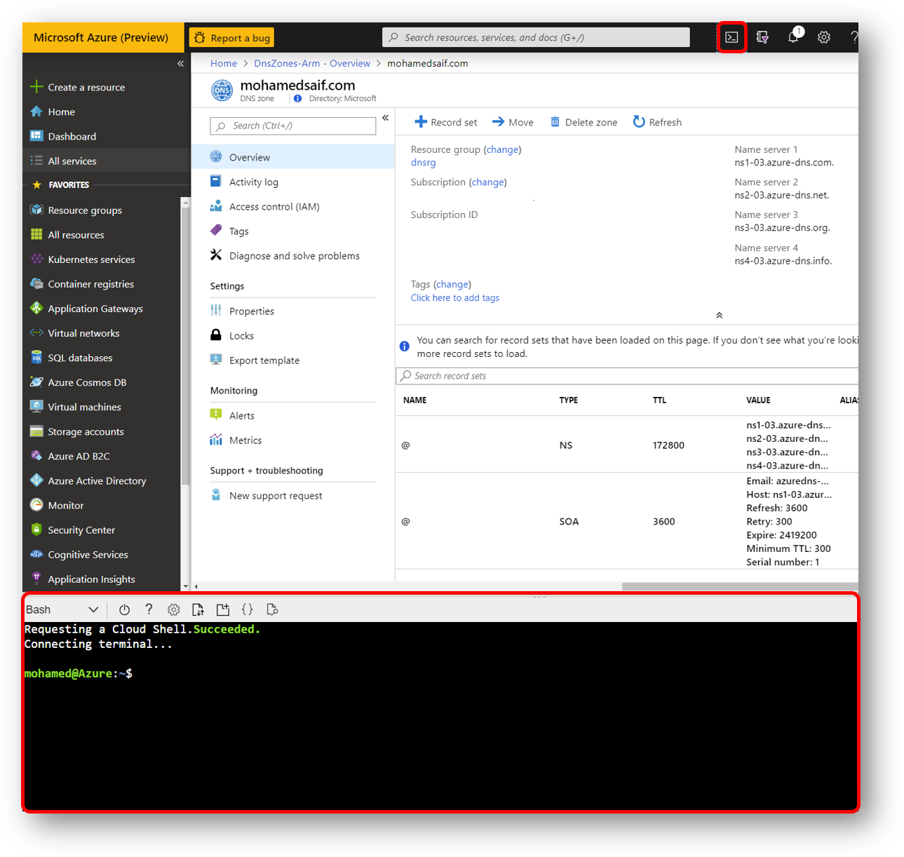

# Creating Azure Prerequisites

Now we are ready to setup our initial Azure resources that will be needed.

>NOTE: You can use the Azure Portal to perform these actions, but I prefer to use scripts as it offer repeatable steps and clear status.

All scripts to provision the entire resources in this guide will have the prefix **azure-prerequisites-XYZ.sh** under [scripts](**../../src/scripts) folder

>NOTE: You need to have Azure CLI installed to be able to execute the below commands. If you don't have that in hand, you can use [Azure Cloud Shell](https://docs.microsoft.com/en-us/azure/cloud-shell/overview) directly from Azure Portal.


## Azure CLI sign in

Fire up your favorite bash terminal and execute the following commands:

```bash

#***** Login to Azure Subscription *****
# A browser window will open to complete the authentication :)
az login

# You can also login using Service Principal (replace values in <>)
# az login --service-principal --username APP_ID --password PASSWORD --tenant TENANT_ID

az account set --subscription "YOUR-SUBSCRIPTION-NAME"

#Make sure the active subscription is set correctly
SUBSCRIPTION_ACCOUNT=$(az account show)
echo $SUBSCRIPTION_ACCOUNT

# Get the tenant ID
TENANT_ID=$(echo $SUBSCRIPTION_ACCOUNT | jq -r .tenantId)
# or use TENANT_ID=$(az account show --query tenantId -o tsv)
echo $TENANT_ID
echo export TENANT_ID=$TENANT_ID >> ~/.bashrc

# Get the subscription ID
SUBSCRIPTION_ID=$(echo $SUBSCRIPTION_ACCOUNT | jq -r .id)
# or use TENANT_ID=$(az account show --query tenantId -o tsv)
echo $SUBSCRIPTION_ID
echo export SUBSCRIPTION_ID=$SUBSCRIPTION_ID >> ~/.bashrc

clear

#***** END Login to Azure Subscription *****

```

## Setting up deployment variables

I use variables to easily change my deployment parameters across multiple scripts and sessions.

```bash

# Setup some variables for reusability
# Please update the values below as it needs to be unique
# Also make sure to use only lower case to avoid conflict with recourses that requires that.
PREFIX="ieworkshop"
RG="${PREFIX}-rg"
LOCATION="westeurope"
FRAMES_STORAGE="${PREFIX}framesstg"
COSMOSDB_ACCOUNT="${PREFIX}telemetrydb"
CONTAINER_REGISTRY_NAME="${PREFIX}contosoacr"
WORKSPACE_NAME="${PREFIX}-logs"

#If you wish to have these values persist across sessions use:
echo export PREFIX=$PREFIX >> ~/.bashrc
echo export RG=$RG >> ~/.bashrc
echo export LOCATION=$LOCATION >> ~/.bashrc
echo export FRAMES_STORAGE=$FRAMES_STORAGE >> ~/.bashrc
echo export COSMOSDB_ACCOUNT=$COSMOSDB_ACCOUNT >> ~/.bashrc

echo export CONTAINER_REGISTRY_NAME=$CONTAINER_REGISTRY_NAME >> ~/.bashrc
echo export WORKSPACE_NAME=$WORKSPACE_NAME >> ~/.bashrc

```

## Creating Resource Group

Resource Group is your virtual folder that we will provision all of our solution resources.

```bash

# Create a resource group
az group create --name $RG --location $LOCATION

```

## Storage Account

[Azure Storage Account](https://docs.microsoft.com/en-us/azure/storage/common/storage-account-overview) offers a cloud storage for your blobs, files, disks,... We will used it to store captured frames from the connected cameras.

```bash

az storage account create \
    -n $FRAMES_STORAGE \
    -g $RG \
    -l $LOCATION \
    --sku Standard_LRS

```

## Cosmos DB

```bash

az cosmosdb create \
    -n $COSMOSDB_ACCOUNT \
    -g $RG \
    --default-consistency-level Eventual

```