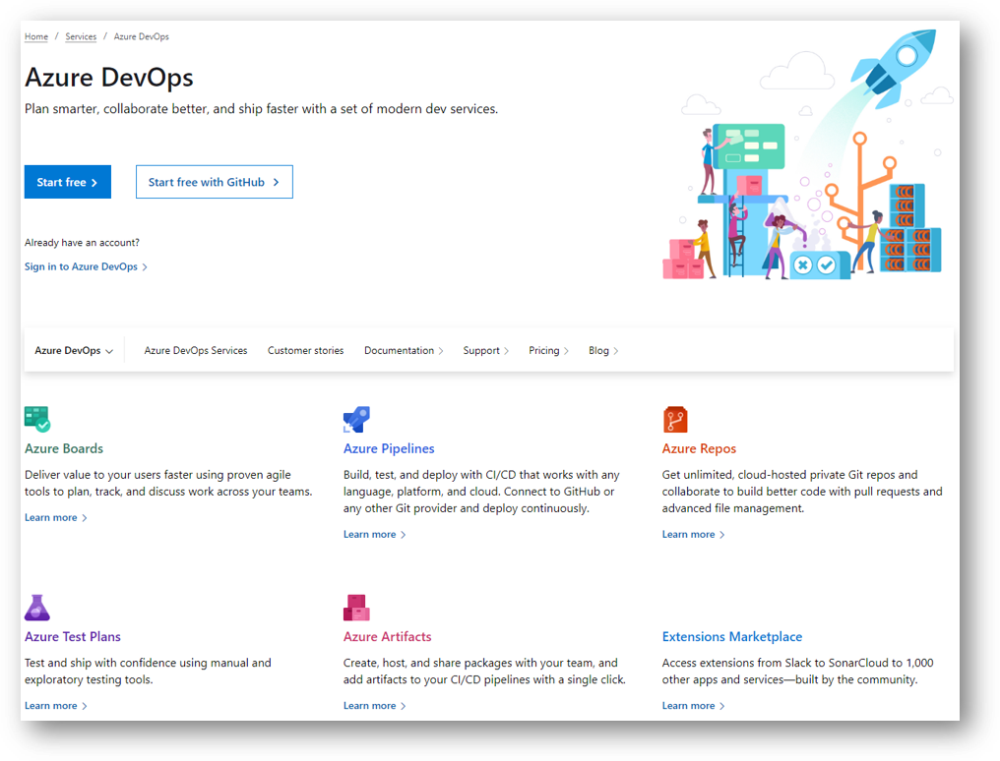
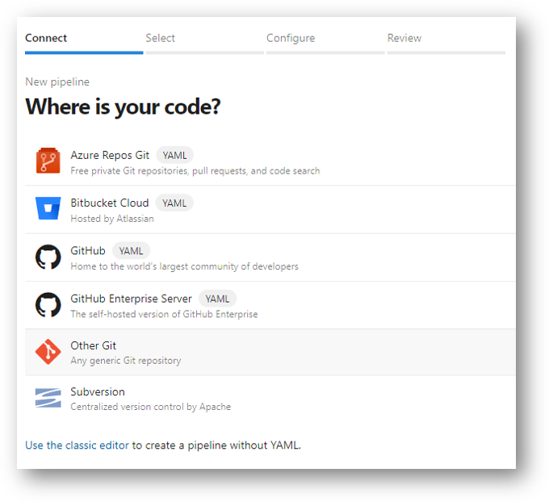
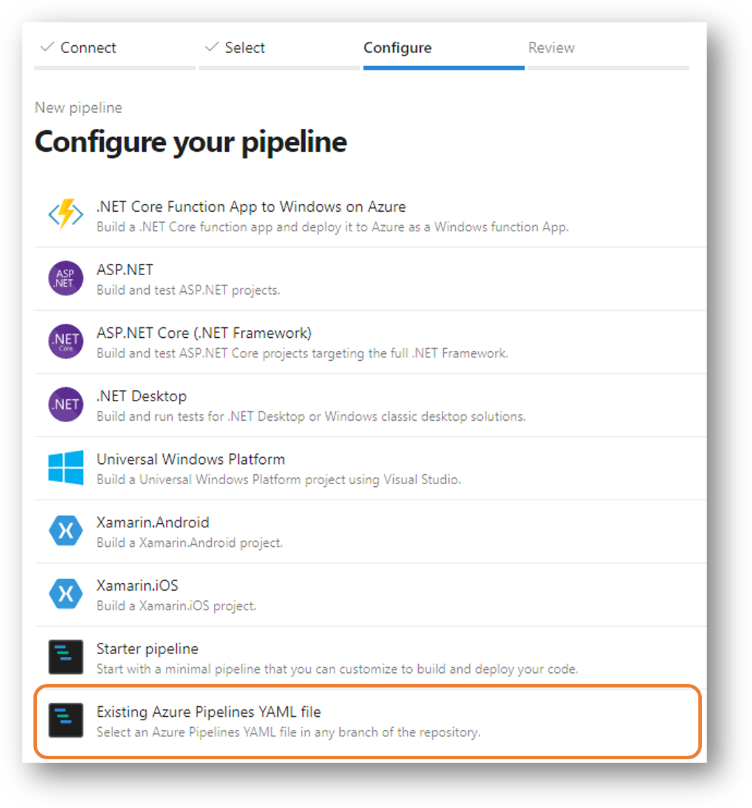

# Services Deployment

Now it is time to deploy and activate the solution.

## DevOps Setup

I'm hosting the source code on GitHub and using Azure DevOps to manage the other aspects of SDL (Azure Boards for project management, Azure Pipelines for CI/CD and Azure Artifacts for custom NuGet packages).

### Source Code

If you want to contribute to this workshop (which I would very much appreciate), I would recommend [Forking the GitHub repo](https://aka.ms/IE-On-Containers).

If you wish to use [Azure Repos](https://azure.microsoft.com/en-us/services/devops/repos/) that is an awesome option as well :)

If you wish to clone it and upload it to other source control platforms, then this what you should do :)

>NOTE: In this workshop guide, I will focus only in one option just to remain focused on the objectives of learning end-to-end life cycle of building and deploying cloud native workloads.

You can start for free on [Azure DevOps](https://azure.microsoft.com/en-us/services/devops/?nav=min). Just click on "Start free >" and create your organization.

Create your a new Azure DevOps project, and setup the initial options

Once you have your code forked or cloned with Azure DevOps project in place, you are ready to proceed.

### Continuos Integration

The workshop leverages Azure Pipelines yaml configuration checked at the root of this workshop code.

#### Importing Pipelines

Overview of CI pipelines:

- Service: CognitiveOrchestrator
- Service: CamFrameAnalyzer
- Service: CrowdAnalyzer
- NuGet: CoreLib
- NuGet: CognitiveServicesHelpers
  
To start importing these pipelines into your Azure DevOps project, just click on New Pipeline under (Pipelines -> Builds)

Select (GitHub YAML) or (Azure Repos Git YAML) based on where is your code:

>NOTE: Selecting GitHub for the first time, you will need to connect Azure DevOps to your GitHub account. If you have challenges, you can review the following lab [Integrate Your GitHub Projects With Azure Pipelines](https://azuredevopslabs.com//labs/azuredevops/github-integration/)

Next you select the project repo. It will differ based on you selection in the previous step:

As we are not starting from scratch, you can select **Existing Azure Pipelines YAML file**:

Select on of the yaml files:

Finally review the content of the yaml file and click on Run to queue a new build process:

CONGRATULATIONS! You first pipeline is now being built.

Please repeat the above steps for each pipeline mentioned (only the template files will not be included. These files end with angular, webapp, nuget and tests)

>NOTE: My Azure Artifacts repo used in public, so you shouldn't face problems restoring the packages I've pushed their. If you received errors in the build, it is worth mentioning that you might need to setup an Azure Artifacts repo, push the Workshop NuGet packages to and then try to build again after updating your nuget.config files with the new source.

>NOTE: Check [Azure Artifacts](https://docs.microsoft.com/en-us/azure/devops/artifacts/get-started-nuget?view=azure-devops) documentations for more information or check our a blog post about [Public Azure Artifacts Feeds](https://devblogs.microsoft.com/devops/new-with-azure-artifacts-public-and-project-scoped-feeds/)

### Continuos Delivery

Creating Release Pipelines to actually deliver the target services to your Azure cloud services.

>NOTE: You will need all the connection strings, keys and values you captured during the previous workshop steps to provision your release pipelines.
